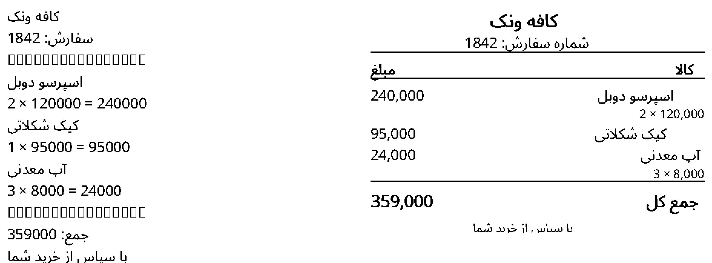
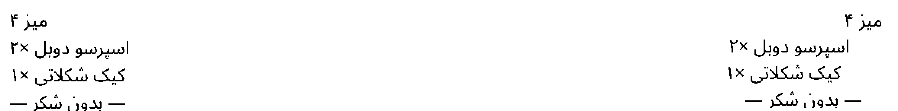

# ESC/POS and Persian rendering

Backend owns byte generation for semantic `invoice`/`receipt` documents. The PWA may also send a validated raw ESC/POS document only after local operator opt-in; arbitrary binary payloads and unrecognized ESC/POS signatures are rejected. Rust encoder supports initialize, ASCII text, bold, alignment, font size, line/feed, cut, QR Model 2, Code128 subset B, fixed-width ASCII tables, monochrome raster and drawer pulse. These are internal Rust APIs.

Persian pipeline:

```text
UTF-8 semantic lines
 → cosmic-text font layout
 → rustybuzz Arabic shaping + Unicode BiDi/line breaking
 → Swash glyph rasterization
 → alpha threshold into 1-bit monochrome bitmap
 → GS v 0 raster stripes (≤128 rows each)
 → feed + optional cut
```

Noto Sans Arabic Regular is embedded, including SIL Open Font License in `src-tauri/assets/OFL-NotoSansArabic.txt`. Asset was obtained from `@expo-google-fonts/noto-sans-arabic@0.4.3`, regular TTF, unmodified; use a reviewed font update process. Selected local system fonts may be used by profile name, never by PWA-supplied filesystem paths. Missing family/glyphs produce `FONT_UNAVAILABLE` / `FONT_GLYPH_MISSING` instead of silently outputting tofu.

The renderer wraps to actual dot width and limits output to 4096 rows. It thresholds alpha at 100 (out of 255); it is not grayscale photography dithering. Paper mm is metadata, width dots controls output. Text scale uses pixels; no native Persian codepage is required. Mixed Persian/Latin numbers and punctuation must pass visual hardware acceptance.

## Who owns the design

There are exactly two answers, and they must not be confused:

| Document             | Who decides the paper layout                                                                                                   | Where the layout lives          |
| -------------------- | ------------------------------------------------------------------------------------------------------------------------------ | ------------------------------- |
| `invoice`, `receipt` | **The agent.** The frontend sends order data only; the agent shapes, positions and rasterizes it.                              | `src-tauri/src/print/layout.rs` |
| `escpos`             | **The frontend.** The agent forwards the finished bytes with no rendering, no font substitution and no added `ESC @`/feed/cut. | The website                     |

So if a receipt's printed design must match a template the MenuVex app owns, the app can send `escpos` after the operator enables both the global raw gate and the printer's `rawPassthrough` switch in local Settings; both default off, and a website cannot enable them. Documents must begin with a recognized ESC/POS command signature and stay within the operator's configured 1 KiB–1 MiB limit. Sending `invoice` and expecting the agent to reproduce an HTML/CSS template is not supported: the agent has no HTML or CSS engine and will apply its own invoice layout instead. That mismatch — not a rendering bug — is the usual reason "the design changed". See [`protocol.md`](protocol.md#frontend-owned-layout-escpos).

On Windows, raw jobs use the Win32 spooler with `DOC_INFO_1W.pDatatype = "RAW"`. This bypasses GDI, but a vendor driver/spooler extension may still reinterpret bytes; Settings warns when the selected queue is not Generic / Text Only and can create a parallel Generic / Text Only queue on a manually selected vendor queue's enumerated USB port. Existing drivers are never replaced. There is no fallback to rendered printing.

## Printed design

`src-tauri/src/print/layout.rs` turns a semantic document into drawing instructions; `print/mod.rs` paints them. Invoices follow the MenuVex app invoice template (deliberately **without** the logo), read right to left:

- Centered header: store name 32% larger and emboldened, then the optional `address` and `تلفن: <phone>` lines at 84%.
- A bold slip row between two rules: `title` (default `فاکتور فروش`) on the right, `فیش <orderNumber>` on the left.
- Optional label/value rows (`تاریخ`, `وضعیت`, `نوع سفارش`, `میز`): label on the **right** margin, value on the **left** margin. Rows appear only when the adapter supplied the field.
- Items on 80 mm paper (≥ 464 printable dots) print as a four column table — `شرح کالا | تعداد | قیمت واحد | جمع` — with a 84% bold header; the description column wraps inside its own column. On 58 mm paper the four columns cannot fit, so each item prints as a `name | line amount` row plus a `quantity × unit price` detail line when the quantity is greater than one.
- Counters after the items: `تعداد اقلام` (the number of item lines) and, only when the adapter sent `subtotal`, `جمع اقلام`.
- The payable row `مبلغ قابل پرداخت` is 20% larger and emboldened. When the adapter sent `currency` (e.g. `تومان`), it is appended to amounts; the agent never invents a currency word.
- An optional `note` prints centered between two **dashed** pixel rules, like the app's note frame.
- The optional `footer` is centered and bold; `POWERED BY MENUVEX.IR` closes every invoice at 66% size, exactly like the app template.
- Amounts and counters are shown in Persian digits with ASCII thousands separators (`240000` → `۲۴۰,۰۰۰`) for readability only. The value is never converted, rounded or recalculated; `total`, `subtotal` and the per-item `quantity × unitPrice` products remain whatever the business adapter supplied.
- Separators are drawn as **pixels** (2 dots at the default font size), never as a font glyph, so the design cannot depend on a character the bundled font may not have. The previous design printed `────────────────` (U+2500), which is absent from Noto Sans Arabic and reached the paper as tofu boxes or, on printers without a fallback, as blank.
- `receipt` ordinary lines hang on the margin of their writing direction (Persian right, Latin/numbers left). Templates can use a line of at least three dash/equal/box-rule characters for a full-width pixel rule, `[center] text` (or `[center]: text`) to center a line, and two to four pipe-separated cells for a right-to-left column row (first cell rightmost, last leftmost, intermediate cells centered). Empty lines add spacing. These layout hints are mirrored by the Legacy Windows renderer. Ordinary receipt lines remain unchanged.
- A 2% side margin (2–24 dots) keeps text off the mechanism edges; the printable width is reduced by it.
- Lines that do not fit one row keep both values: the row is stacked into two aligned lines instead of overflowing or clipping.

Font size in the printer profile is the **base** size of the body text in dots; the design scales it by fixed percentages above. Changing the base size therefore rescales the whole design proportionally. Font/cosmic-text upgrades and design changes can alter line wrapping: treat them as output compatibility changes.

Reference sheets (previous design on the left, current design on the right), generated by the tool below:





## Reviewing the design without hardware

`tools/receipt-preview/preview.py` mirrors this layout (and the previous one, for comparison) with HarfBuzz and the **same bundled font**, and writes 1-bit PNG previews plus the `*-compare.png` sheets above:

```sh
python3 -m pip install uharfbuzz freetype-py pillow
npm run preview:receipt                     # or: python3 tools/receipt-preview/preview.py
npm run preview:receipt -- --width 384      # 58mm paper
```

It asserts the invariants above before rendering: money grouping, planner labels/sizes, every planned character having a glyph in the bundled font (the U+2500 regression is covered by a negative check) and the 4096 row limit. The CI recipe (`docs/ci/checks.yml`, still an inert template until a maintainer with workflow write permission activates it) runs it and uploads the previews as the `Receipt-Design-Preview` artifact, because a passing raster test only proves the bytes are well formed, not that the design is right. The preview remains an approximation: hardware acceptance on the real model is still required.

Encoder and design-planner tests assert initialization/control sequences, raster header/size validation and the layout rules above. Full render hardware/screenshot baselines must be added after native compilation is available; the current live test checks actual encoding/transport handoff, not visual typography quality. The committed `docs/receipt-design/` sheets are design references produced by the preview tool, not hardware captures.

Cash drawer is internal-only, fixed conservative example pulse (pin 0, on/off timings). It is **not** called by invoice/test documents. Exposing drawer, arbitrary raster images or QR semantic elements requires an explicit versioned schema and device authorization review.
